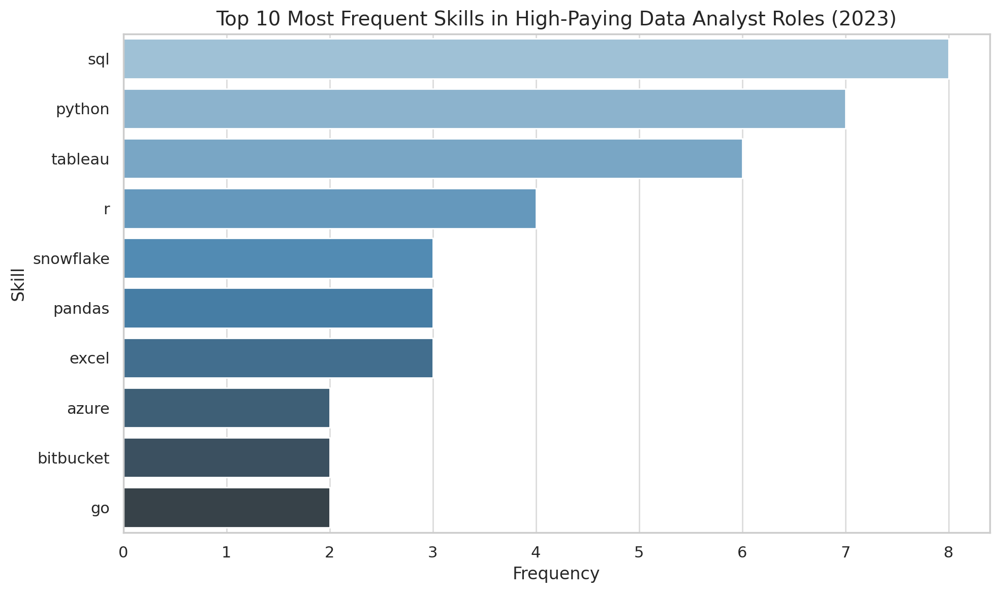

# INTRODUCTION
Dive into the data job market! Focusing on data analyst roles, this project explores top-paying jobs, in-demand skills, and where high demand meets high salary in data analytics.

SQL queries? Check them out here: [project_sql folder](/project_sql/)

# Background
Driven by a quest to navigate the data analyst job market more effectively, this project was born from a desire to pinpoint top-paid and in-demand skills, streamlining others' work to find optimal jobs.

Data hails from Luke Barousse [SQL Course](https://lukebarousse.com/sql). It's packed with insights on job titles, salaries, locations, and essential skills.

### The questions I wanted to answer through my SQL queries were:

1. What are the top-paying data analyst jobs?
2. What skills are required for these top-paying jobs?
3. What skills are most in demand for data analysts?
4. Which skills are associated with higher salaries?
5. What are the most optimal skills to learn?

# TOOLS I USED
 - **SQL**
 - **PostgreSqL**
 - **VS Code**
 - **Git and GitHub**


# THE ANALYSIS
Specific aspects of the data analyst market. Here's how I approached each question:
### 1

To identify the highest-paying roles, I filtered data analyst positions by average yearly salary and location, focusing on remote jobs. This query highlights the high paying opportunities in the field.

```sql
SELECT
    job_id,
    name as Company_name,
    job_title,
    job_location,
    job_schedule_type,
    salary_year_avg,
    job_posted_date
    
FROM 
    job_postings_fact
LEFT JOIN company_dim ON
job_postings_fact.company_id=company_dim.company_id

WHERE
    job_title_short='Data Analyst' AND
    job_location='Anywhere' AND
    salary_year_avg IS NOT NULL
    
ORDER BY salary_year_avg DESC
LIMIT 10
```
Here's the breakdown of the top data analyst jobs in 2023:

- **Wide Salary Range:** Top 10 paying data analyst roles span from $184,000 to $650,000, indicating significant salary potential in the field.

- **Diverse Employers:** Companies like SmartAsset, Meta, and AT&T are among those offering high salaries, showing a broad interest across different industries.

- **Job Title Variety:** There’s a high diversity in job titles, from Data Analyst to Director of Analytics, reflecting varied roles and specializations within data analytics.


*Bar graph generated by AI visualising the result*

### What I Learned
Through this project, I strengthened my SQL and data analysis skills by working with real job posting data. Key takeaways:

- **CTEs (Common Table Expressions)**: Learned to structure complex queries cleanly using WITH clauses for modular and readable code.

- **Querying & Filtering**: Gained experience using JOIN, WHERE, and ORDER BY to extract targeted job data and enrich it with company and skill info.

- **Aggregation**: Used GROUP BY and COUNT to analyze skill frequency and job trends.

- **Many-to-One Relationships**: Learned how to handle multi-row skill entries per job and derive insights like top skills and co-occurring skill pairs.

- **SQL + Python Workflow**: Combined SQL querying with Python visualizations to present insights effectively.

This project showed me how SQL can power real-world data stories when paired with thoughtful analysis and visualization.


### CONCLUSIONS   
This project aimed to uncover patterns in top-paying Data Analyst roles (2023) using SQL and Python. Below are the key insights from each part of the analysis:

## Closing Thought
This project not only helped me sharpen my SQL querying and data storytelling abilities but also gave me a deeper understanding of the skill landscape for data analysts. It reinforced the importance of being technically versatile — blending programming, visualization, and cloud skills — to stay competitive in today’s data-driven job market.